# ES20 P2 submission, Group 06

## Feature PPA

### Subgroup
 - Duarte Santos, ist189438, duarte-santos
    + Issues assigned: [#50](https://github.com/tecnico-softeng/es20al_06-project/issues/50), [#54](https://github.com/tecnico-softeng/es20al_06-project/issues/54), [#64](https://github.com/tecnico-softeng/es20al_06-project/issues/64), [#77](https://github.com/tecnico-softeng/es20al_06-project/issues/77), [#79](https://github.com/tecnico-softeng/es20al_06-project/issues/79), [#80](https://github.com/tecnico-softeng/es20al_06-project/issues/81), [#81](https://github.com/tecnico-softeng/es20al_06-project/issues/81)
  
 - Sofia Carvalho, ist189539, Sofitch
    + Issues assigned: [#48](https://github.com/tecnico-softeng/es20al_06-project/issues/48), [#65](https://github.com/tecnico-softeng/es20al_06-project/issues/65), [#67](https://github.com/tecnico-softeng/es20al_06-project/issues/67), [#73](https://github.com/tecnico-softeng/es20al_06-project/issues/73), [#76](https://github.com/tecnico-softeng/es20al_06-project/issues/76), [#82](https://github.com/tecnico-softeng/es20al_06-project/issues/82)

 
### Pull requests associated with this feature

The list of pull requests associated with this feature is:

 - [PR #062](https://github.com/tecnico-softeng/es20al_06-project/pull/62)
 - [PR #072](https://github.com/tecnico-softeng/es20al_06-project/pull/72)
 - [PR #078](https://github.com/tecnico-softeng/es20al_06-project/pull/78)
 - [PR #088](https://github.com/tecnico-softeng/es20al_06-project/pull/88)

### Web services definition

#### Controllers
 - [StudentQuestionController](https://github.com/tecnico-softeng/es20al_06-project/blob/develop/backend/src/main/java/pt/ulisboa/tecnico/socialsoftware/tutor/studentQuestion/StudentQuestionController.java)

### Feature testing

Each subgroup member defined one reading test and one writing test. The direct links to these are:

 - [CreateStudentQuestionTestJMeter](https://github.com/tecnico-softeng/es20al_06-project/blob/develop/backend/jmeter/studentQuestion/WSCreateStudentQuestionTest.jmx)
 - [EvaluateStudentQuestionTestJMeter](https://github.com/tecnico-softeng/es20al_06-project/blob/develop/backend/jmeter/studentQuestion/WSEvaluateStudentQuestionTest.jmx)
 - [ViewStudentQuestionsTestJMeter](https://github.com/tecnico-softeng/es20al_06-project/blob/develop/backend/jmeter/studentQuestion/WSViewStudentQuestionsTest.jmx)

#### Screenshots of Results Trees and DB cleanup

CreateStudentQuestionTest:
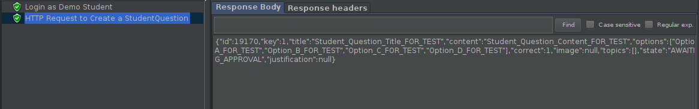
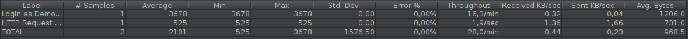
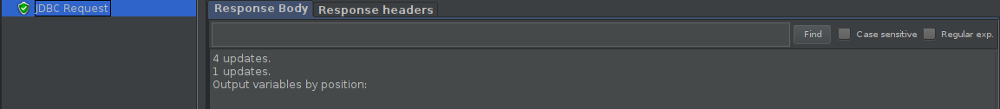

EvaluateStudentQuestionTest:
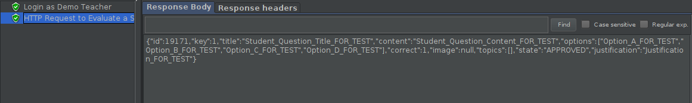
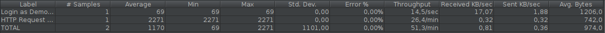
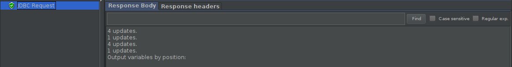

ViewStudentQuestionsTest:
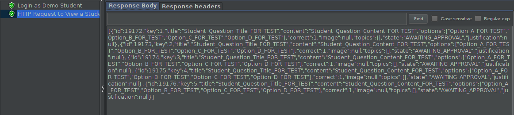

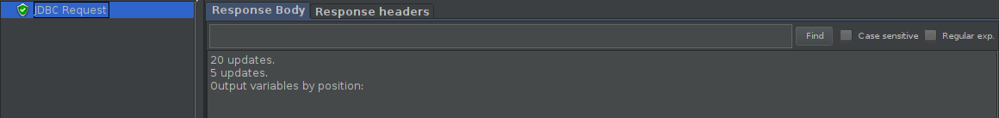

### Load testing

Each subgroup member defined one reading test and one writing test. The direct links to these are:

 - [CreateStudentQuestionLoadTestJMeter](https://github.com/tecnico-softeng/es20al_06-project/blob/develop/backend/jmeter/studentQuestion/WSCreateStudentQuestionLoadTest.jmx)
 - [EvaluateStudentQuestionLoadTestJMeter](https://github.com/tecnico-softeng/es20al_06-project/blob/develop/backend/jmeter/studentQuestion/WSEvaluateStudentQuestionLoadTest.jmx)
 - [ViewStudentQuestionsLoadTestJMeter](https://github.com/tecnico-softeng/es20al_06-project/blob/develop/backend/jmeter/studentQuestion/WSViewStudentQuestionsLoadTest.jmx)

#### Screenshots of Summary Reports and DB cleanup

CreateStudentQuestionLoadTest:
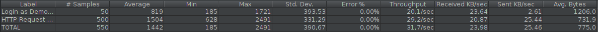
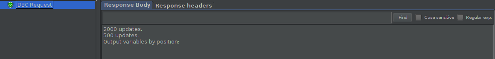

EvaluateStudentQuestionLoadTest:
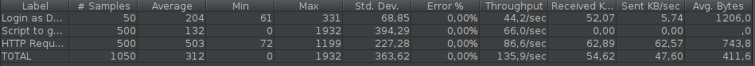
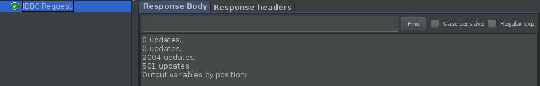

ViewStudentQuestionsLoadTest:
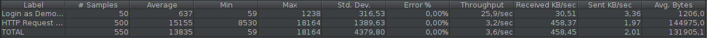
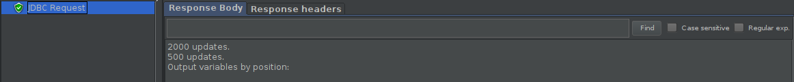

### Service profiling

We used the [Async Profiler](https://www.jetbrains.com/help/idea/async-profiler.html).

#### Screenshots of summary reports

CreateStudentQuestion Profiling:
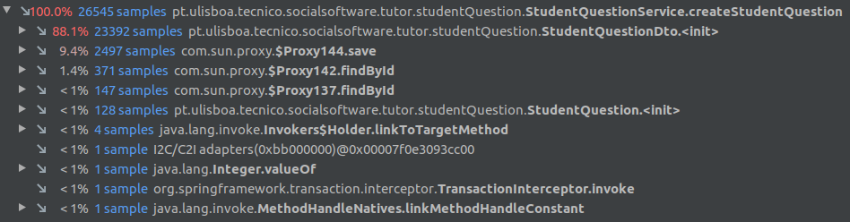
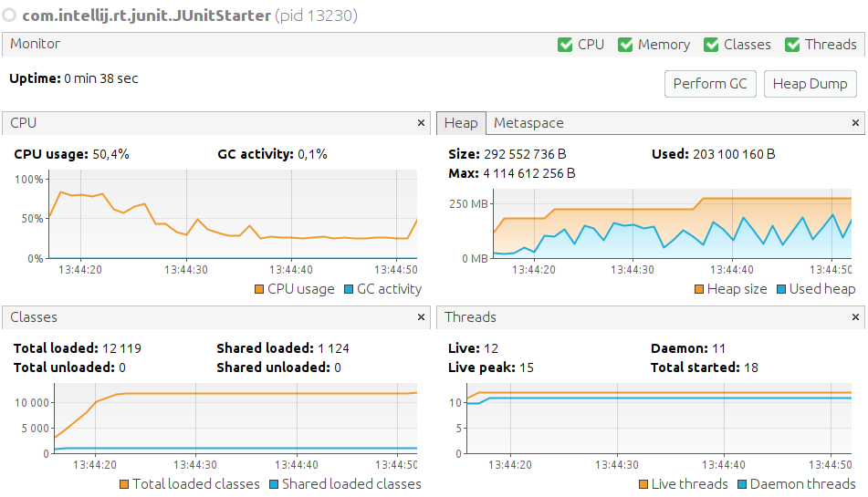
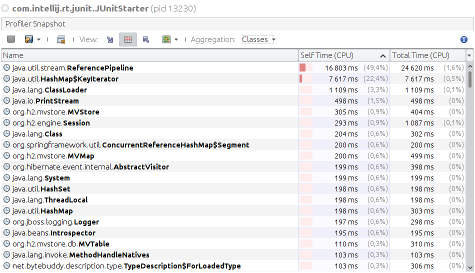

EvaluateStudentQuestion Profiling:
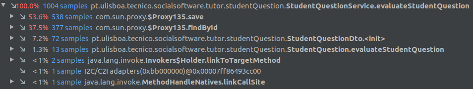

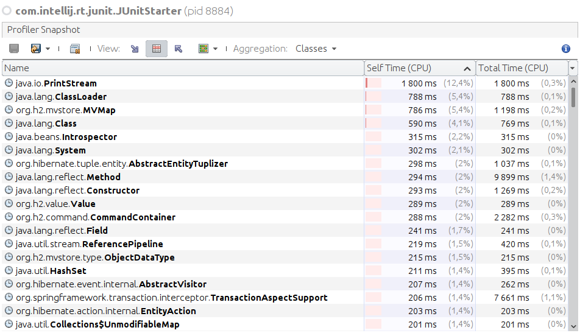

ViewStudentQuestions Profiling:
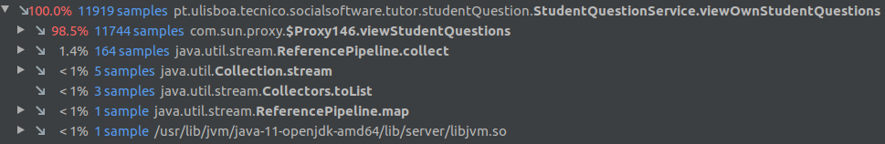
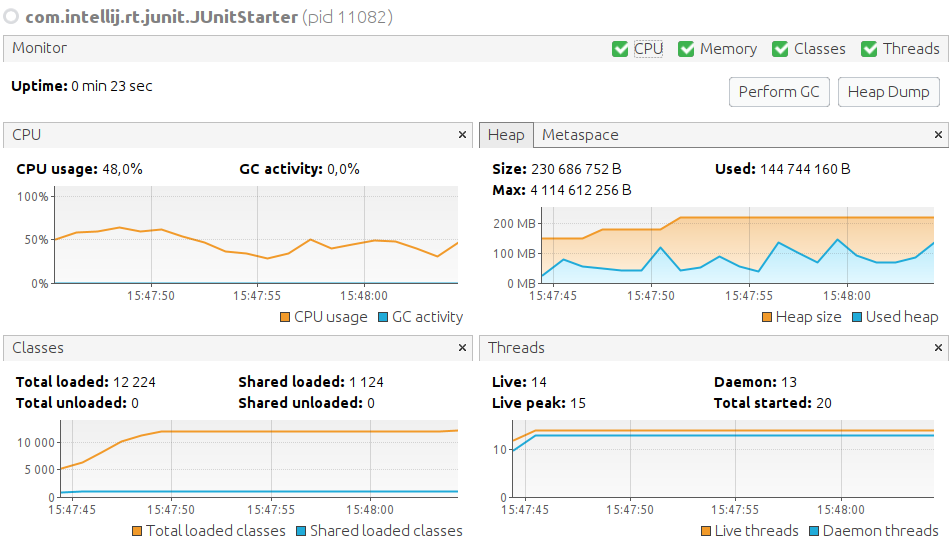
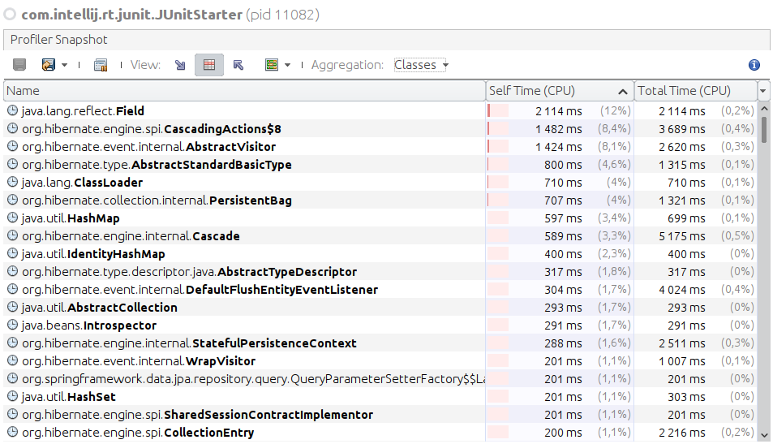

#### Discussion of findings

In the service's method createStudentQuestion most of the computational time is spent initializing the Data Transfer Object.
In the service's method evaluateStudentQuestion most of the computational time is spent in hibernate methods associated with saving and retrieving data from/to the database (save and find).
In the service's method viewStudentQuestion most of the computational time is spent in hibernate methods associated with retrieving data from the database (view).

---

## Feature TDP

### Subgroup
 - Afonso Ribeiro, 89400, deadstrobe5
   + Issues assigned: [#49](https://github.com/tecnico-softeng/es20al_06-project/issues/49), [#51](https://github.com/tecnico-softeng/es20al_06-project/issues/51), [#55](https://github.com/tecnico-softeng/es20al_06-project/issues/55), [#57](https://github.com/tecnico-softeng/es20al_06-project/issues/57), [#58](https://github.com/tecnico-softeng/es20al_06-project/issues/58), [#69](https://github.com/tecnico-softeng/es20al_06-project/issues/69), [#70](https://github.com/tecnico-softeng/es20al_06-project/issues/70)
 - Guilherme Palma, 89452, guilherme439
   + Issues assigned: [#52](https://github.com/tecnico-softeng/es20al_06-project/issues/52), [#56](https://github.com/tecnico-softeng/es20al_06-project/issues/56), [#63](https://github.com/tecnico-softeng/es20al_06-project/issues/63), [#68](https://github.com/tecnico-softeng/es20al_06-project/issues/68), [#71](https://github.com/tecnico-softeng/es20al_06-project/issues/71), 
 - Francisco Henriques, 75278, 0bucket
   + Issues assigned: [#66](https://github.com/tecnico-softeng/es20al_06-project/issues/66), [#69](https://github.com/tecnico-softeng/es20al_06-project/issues/69)
   
 
### Pull requests associated with this feature

The list of pull requests associated with this feature is:

 - [PR #53](https://github.com/tecnico-softeng/es20al_06-project/pull/53)
 - [PR #75](https://github.com/tecnico-softeng/es20al_06-project/pull/75)
 - [PR #85](https://github.com/tecnico-softeng/es20al_06-project/pull/85)

### Web services definition

#### Controllers
 - [TournamentController](https://github.com/tecnico-softeng/es20al_06-project/blob/develop/backend/src/main/java/pt/ulisboa/tecnico/socialsoftware/tutor/tournament/TournamentController.java)

### Feature testing

Each subgroup member defined one reading test and one writing test. The direct links to these are:

 - [CreateTournamentTestJMeter](https://github.com/tecnico-softeng/es20al_06-project/blob/tdp/backend/jmeter/tournament/WSCreateTournamentTest.jmx)
 - [ShowAllOpenTournamentsTestJMeter](https://github.com/tecnico-softeng/es20al_06-project/blob/tdp/backend/jmeter/tournament/WSShowAllOpenTournamentsTest.jmx)
 - [EnrollInTournamentTestJMeter](https://github.com/tecnico-softeng/es20al_06-project/blob/tdp/backend/jmeter/tournament/WSEnrollInTournamentTest.jmx)

#### Screenshots of Results Trees and DB cleanup

CreateTournamentTest:

ShowAllOpenTournamentsTest:

EnrollInTournamentTest:

### Load testing

Each subgroup member defined one reading test and one writing test. The direct links to these are:

 - [CreateTournamentLoadTestJMeter](https://github.com/tecnico-softeng/es20al_06-project/blob/tdp/backend/jmeter/tournament/WSCreateTournamentLoadTest.jmx)
 - [ShowAllOpenTournamentsLoadTestJMeter](https://github.com/tecnico-softeng/es20al_06-project/blob/tdp/backend/jmeter/tournament/WSShowAllOpenTournamentsLoadTest.jmx)
 - [EnrollInTournamentLoadTestJMeter](https://github.com/tecnico-softeng/es20al_06-project/blob/tdp/backend/jmeter/tournament/WSEnrollInTournamentLoadTest.jmx)

#### Screenshots of Summary Reports and DB cleanup

CreateTournamentLoadTest:

ShowAllOpenTournamentsLoadTest:

EnrollInTournamentLoadTest:

### Service profiling

We used the [Async Profiler](https://www.jetbrains.com/help/idea/async-profiler.html).

#### Screenshots of summary reports

CreateTournament Profiling:

ShowAllOpenTournaments Profiling:

EnrollInTournament Profiling:

#### Discussion of findings

In the services that access the database extensively (CreateTournament and ShowAllOpenCourses) most of the computacional time is spent in hibernate methods.
In the service EnrollInTournament, creating UserDto's is what defines most of the service performance.

