# ES20 P2 submission, Group 06

## Feature PPA

### Subgroup
 - Nome, istID, githubID
   + Issues assigned: [#1](https://github.com), [#3](https://github.com)
 - Nome, istID, githubID
   + Issues assigned: [#2](https://github.com), [#4](https://github.com)
 
### Pull requests associated with this feature

The list of pull requests associated with this feature is:

 - [PR #000](https://github.com)
 - [PR #001](https://github.com)
 - [PR #002](https://github.com)

### Web services definition

#### Controllers
 - [Controller0](https://github.com)
 - [Controller1](https://github.com)

### Feature testing

Each subgroup member defined one reading test and one writing test. The direct links to these are:

 - [ReadingTestJMeter](https://github.com)
 - [WritingTestJMeter](https://github.com)

#### Screenshots of Results Trees and DB cleanup

### Load testing

Each subgroup member defined one reading test and one writing test. The direct links to these are:

 - [ReadingTestJMeter](https://github.com)
 - [WritingTestJMeter](https://github.com)

#### Screenshots of Summary Reports and DB cleanup

### Service profiling

We used the [Async Profiler](https://www.jetbrains.com/help/idea/async-profiler.html).

#### Screenshots of summary reports

#### Discussion of findings

**TODO**: include here a short description of findings (max. 3 sentences). If
you found opportunities for optimization, you can use more than 3 sentences to
describe what you found and how you optimized your code.

---

## Feature TDP

### Subgroup
 - Afonso Ribeiro, 89400, deadstrobe5
   + Issues assigned: [#49](https://github.com/tecnico-softeng/es20al_06-project/issues/49), [#51](https://github.com/tecnico-softeng/es20al_06-project/issues/51), [#55](https://github.com/tecnico-softeng/es20al_06-project/issues/55), [#57](https://github.com/tecnico-softeng/es20al_06-project/issues/57), [#58](https://github.com/tecnico-softeng/es20al_06-project/issues/58), [#69](https://github.com/tecnico-softeng/es20al_06-project/issues/69), [#70](https://github.com/tecnico-softeng/es20al_06-project/issues/70)
 - Guilherme Palma, 89452, guilherme439
   + Issues assigned: [#52](https://github.com/tecnico-softeng/es20al_06-project/issues/52), [#56](https://github.com/tecnico-softeng/es20al_06-project/issues/56), [#63](https://github.com/tecnico-softeng/es20al_06-project/issues/63), [#68](https://github.com/tecnico-softeng/es20al_06-project/issues/68), [#71](https://github.com/tecnico-softeng/es20al_06-project/issues/71), 
 - Francisco Henriques, 75278, 0bucket
   + Issues assigned: [#66](https://github.com/tecnico-softeng/es20al_06-project/issues/66), [#69](https://github.com/tecnico-softeng/es20al_06-project/issues/69)
   
 
### Pull requests associated with this feature

The list of pull requests associated with this feature is:

 - [PR #53](https://github.com/tecnico-softeng/es20al_06-project/pull/53)
 - [PR #75](https://github.com/tecnico-softeng/es20al_06-project/pull/75)
 - [PR #85](https://github.com/tecnico-softeng/es20al_06-project/pull/85)

### Web services definition

#### Controllers
 - [TournamentController](https://github.com/tecnico-softeng/es20al_06-project/blob/develop/backend/src/main/java/pt/ulisboa/tecnico/socialsoftware/tutor/tournament/TournamentController.java)

### Feature testing

Each subgroup member defined one reading test and one writing test. The direct links to these are:

 - [CreateTournamentTestJMeter](https://github.com/tecnico-softeng/es20al_06-project/blob/tdp/backend/jmeter/tournament/WSCreateTournamentTest.jmx)
 - [ShowAllOpenTournamentsTestJMeter](https://github.com/tecnico-softeng/es20al_06-project/blob/tdp/backend/jmeter/tournament/WSShowAllOpenTournamentsTest.jmx)
 - [EnrollInTournamentTestJMeter](https://github.com/tecnico-softeng/es20al_06-project/blob/tdp/backend/jmeter/tournament/WSEnrollInTournamentTest.jmx)

#### Screenshots of Results Trees and DB cleanup

CreateTournamentTest:
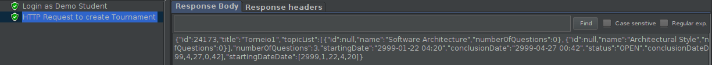
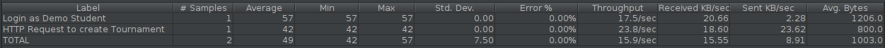
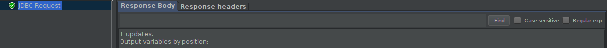

ShowAllOpenTournamentsTest:
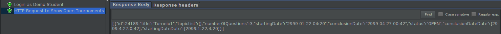
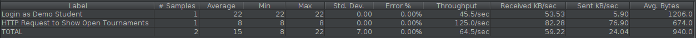
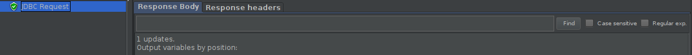

EnrollInTournamentTest:
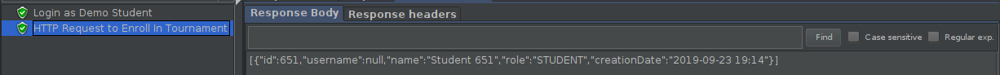
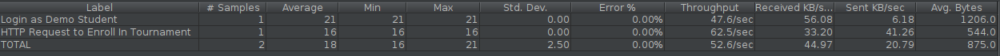
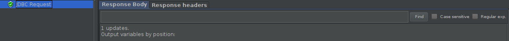

### Load testing

Each subgroup member defined one reading test and one writing test. The direct links to these are:

 - [CreateTournamentLoadTestJMeter](https://github.com/tecnico-softeng/es20al_06-project/blob/tdp/backend/jmeter/tournament/WSCreateTournamentLoadTest.jmx)
 - [ShowAllOpenTournamentsLoadTestJMeter](https://github.com/tecnico-softeng/es20al_06-project/blob/tdp/backend/jmeter/tournament/WSShowAllOpenTournamentsLoadTest.jmx)
 - [EnrollInTournamentLoadTestJMeter](https://github.com/tecnico-softeng/es20al_06-project/blob/tdp/backend/jmeter/tournament/WSEnrollInTournamentLoadTest.jmx)

#### Screenshots of Summary Reports and DB cleanup

CreateTournamentLoadTest:
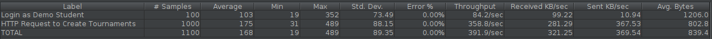
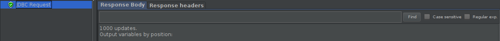

ShowAllOpenTournamentsLoadTest:
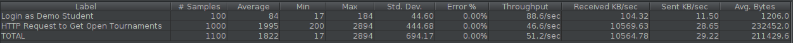
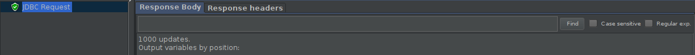

EnrollInTournamentLoadTest:

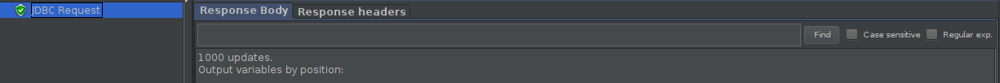

### Service profiling

We used the [Async Profiler](https://www.jetbrains.com/help/idea/async-profiler.html).

#### Screenshots of summary reports

CreateTournament Profiling:
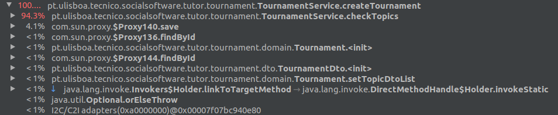

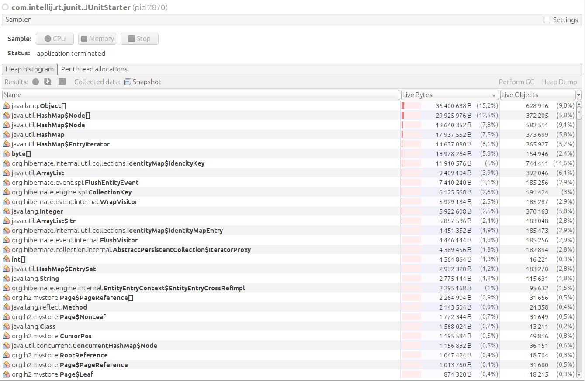

ShowAllOpenTournaments Profiling:
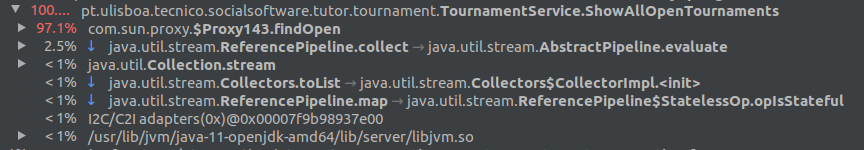
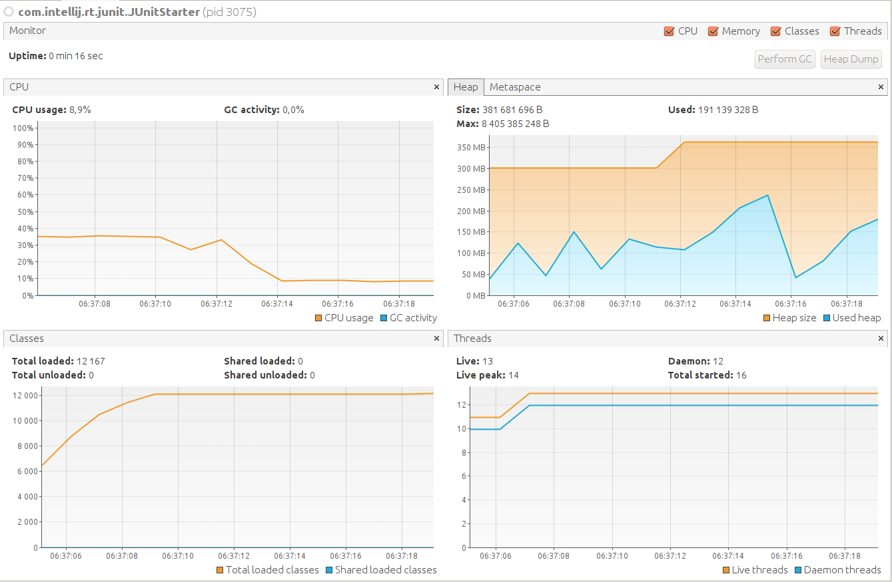
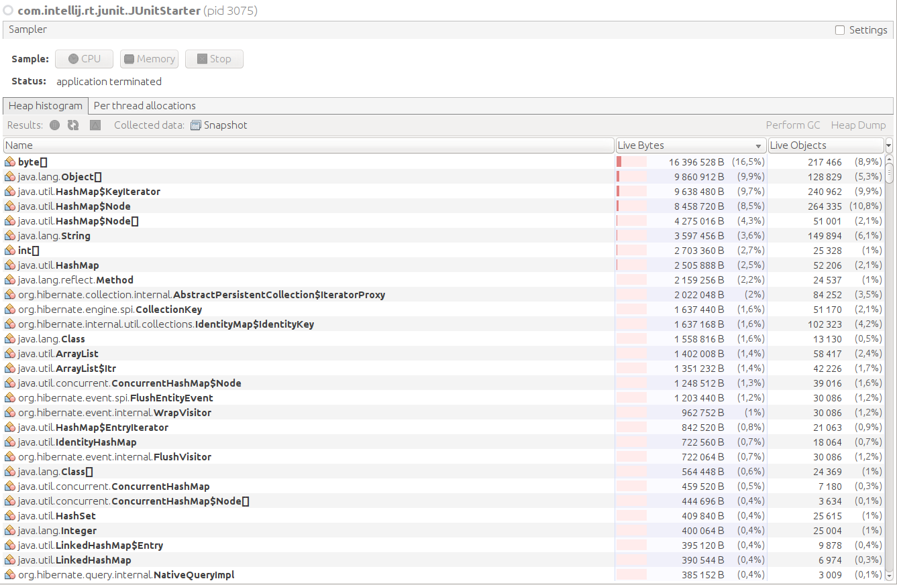

EnrollInTournament Profiling:
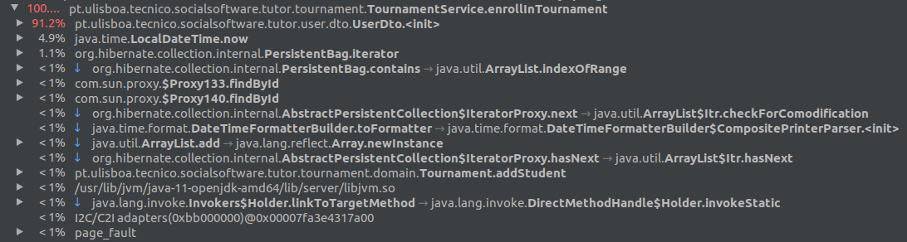
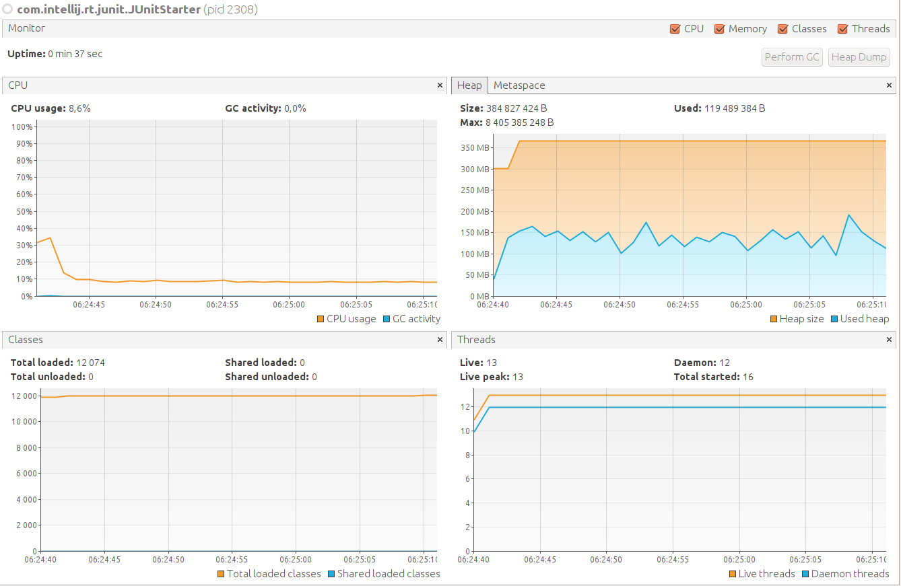
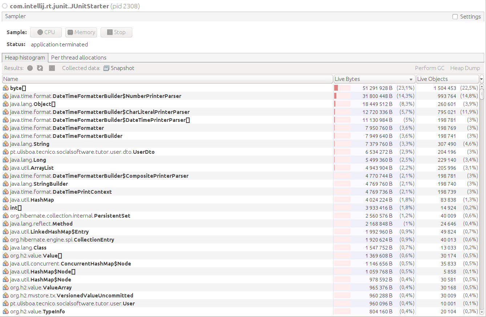

#### Discussion of findings

In the services that access the database extensively (CreateTournament and ShowAllOpenCourses) most of the computacional time is spent in hibernate methods.
In the service EnrollInTournament, creating UserDto's is what defines most of the service performance.

