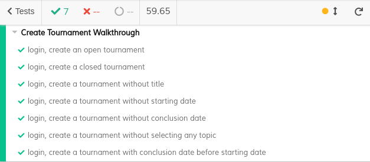
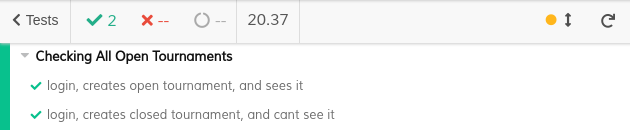
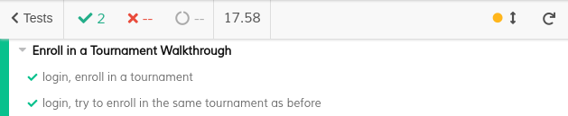

# ES20 P3 submission, Group 06

## Feature PPA

### Subgroup

 - Duarte Santos, ist189438, duarte-santos
    + Issues assigned: [#93](https://github.com/tecnico-softeng/es20al_06-project/issues/93), [#95](https://github.com/tecnico-softeng/es20al_06-project/issues/95), [#105](https://github.com/tecnico-softeng/es20al_06-project/issues/105), [#106](https://github.com/tecnico-softeng/es20al_06-project/issues/106), [#107](https://github.com/tecnico-softeng/es20al_06-project/issues/107)
    
 - Sofia Carvalho, ist189539, Sofitch
    + Issues assigned: [#94](https://github.com/tecnico-softeng/es20al_06-project/issues/94), [#96](https://github.com/tecnico-softeng/es20al_06-project/issues/96), [#100](https://github.com/tecnico-softeng/es20al_06-project/issues/100), [#110](https://github.com/tecnico-softeng/es20al_06-project/issues/110)

### Pull requests associated with this feature

The list of pull requests associated with this feature is:

  - [PR #097](https://github.com/tecnico-softeng/es20al_06-project/pull/97)
  - [PR #099](https://github.com/tecnico-softeng/es20al_06-project/pull/99)
  - [PR #102](https://github.com/tecnico-softeng/es20al_06-project/pull/102)
  - [PR #113](https://github.com/tecnico-softeng/es20al_06-project/pull/113)

### Frontend

#### New/Updated Views

 - [StudentQuestionView](https://github.com/tecnico-softeng/es20al_06-project/blob/develop/frontend/src/views/student/studentQuestion/StudentQuestionView.vue)
    + [ShowStudentQuestionDialog](https://github.com/tecnico-softeng/es20al_06-project/blob/develop/frontend/src/views/student/studentQuestion/ShowStudentQuestionDialog.vue)
    + [ShowStudentQuestion](https://github.com/tecnico-softeng/es20al_06-project/blob/develop/frontend/src/views/student/studentQuestion/ShowStudentQuestion.vue)
    + [EditStudentQuestionDialog](https://github.com/tecnico-softeng/es20al_06-project/blob/develop/frontend/src/views/student/studentQuestion/EditStudentQuestionDialog.vue)
    + [EditStudentQuestionTopics](https://github.com/tecnico-softeng/es20al_06-project/blob/develop/frontend/src/views/student/studentQuestion/EditStudentQuestionTopics.vue)
 - [EvaluateQuestionsView](https://github.com/tecnico-softeng/es20al_06-project/blob/develop/frontend/src/views/teacher/studentQuestions/EvaluateQuestionsView.vue)
    + [EvaluateStudentQuestionDialog](https://github.com/tecnico-softeng/es20al_06-project/blob/develop/frontend/src/views/teacher/studentQuestions/EvaluateStudentQuestionDialog.vue)

#### New/Updated Models

 - [StudentQuestion](https://github.com/tecnico-softeng/es20al_06-project/blob/develop/frontend/src/models/management/StudentQuestion.ts)

### Additional services implemented

 - [RemoveStudentQuestion (Service)](https://github.com/tecnico-softeng/es20al_06-project/blob/develop/backend/src/main/java/pt/ulisboa/tecnico/socialsoftware/tutor/studentQuestion/StudentQuestionService.java#L160)
    + [Controller](https://github.com/tecnico-softeng/es20al_06-project/blob/develop/backend/src/main/java/pt/ulisboa/tecnico/socialsoftware/tutor/studentQuestion/StudentQuestionController.java#L97)
    + [Spock tests](https://github.com/tecnico-softeng/es20al_06-project/blob/develop/backend/src/test/groovy/pt/ulisboa/tecnico/socialsoftware/tutor/studentQuestion/service/RemoveStudentQuestionServiceSpockTest.groovy)
    + [Feature test (JMeter)](https://github.com/tecnico-softeng/es20al_06-project/blob/ppa/backend/jmeter/studentQuestion/WSDeleteStudentQuestionTest.jmx)

### End-to-end tests

#### Created tests

 - [Creates and deletes a student question](https://github.com/tecnico-softeng/es20al_06-project/blob/develop/frontend/tests/e2e/specs/studentQuestion/manageStudentQuestion.js#L30)
 - [Try to create a student question with wrong input](https://github.com/tecnico-softeng/es20al_06-project/blob/develop/frontend/tests/e2e/specs/studentQuestion/manageStudentQuestion.js#L36)
 - [Create a student question, teacher evaluates the question](https://github.com/tecnico-softeng/es20al_06-project/blob/develop/frontend/tests/e2e/specs/studentQuestion/manageStudentQuestion.js#L58)
 - [Creates 3 student questions, teacher evaluates 2, student views the evaluations](https://github.com/tecnico-softeng/es20al_06-project/blob/develop/frontend/tests/e2e/specs/studentQuestion/manageStudentQuestion.js#L73)
 - [Creates a student questions, try to evaluate question with wrong input](https://github.com/tecnico-softeng/es20al_06-project/blob/develop/frontend/tests/e2e/specs/studentQuestion/manageStudentQuestion.js#L93)

#### Rationale

1. Students will submit and delete questions (basic case).
2. Show invalid cases i.e. students might try to submit a question without enough information.
3. Teachers will evaluate questions submitted by the students (basic case).
4. Students will need to see the feedback on their submitted question. In this test we also test all the possible evaluations.
5. Show invalid cases i.e. teachers might try to reject a submitted question without a proper justification.

#### Commands defined

 - [commands.js](https://github.com/socialsoftware/quizzes-tutor/blob/develop/frontend/tests/e2e/support/commands.js)

#### Screenshot of test results overview

---

## Feature TDP

### Subgroup

 - Afonso Ribeiro, 89400, deadstrobe5
   + Issues assigned: [#98](https://github.com/tecnico-softeng/es20al_06-project/issues/98), [#104](https://github.com/tecnico-softeng/es20al_06-project/issues/104), [#108](https://github.com/tecnico-softeng/es20al_06-project/issues/108), [#111](https://github.com/tecnico-softeng/es20al_06-project/issues/111)
 - Guilherme Palma, 89452, guilherme439
   + Issues assigned: [#101](https://github.com/tecnico-softeng/es20al_06-project/issues/101), [#103](https://github.com/tecnico-softeng/es20al_06-project/issues/103), [#109](https://github.com/tecnico-softeng/es20al_06-project/issues/109)
 - Francisco Henriques, 75278, 0bucket
   + Issues assigned: [#90](https://github.com/tecnico-softeng/es20al_06-project/issues/90), [#89](https://github.com/tecnico-softeng/es20al_06-project/issues/89), [#91](https://github.com/tecnico-softeng/es20al_06-project/issues/91)
 
### Pull requests associated with this feature

The list of pull requests associated with this feature is:

 - [PR #112](https://github.com/tecnico-softeng/es20al_06-project/pull/112)
 - [PR #114](https://github.com/tecnico-softeng/es20al_06-project/pull/114)

### Frontend

#### Updated Views

 - [HomeView](https://github.com/tecnico-softeng/es20al_06-project/blob/91cabed45ab320e6ca09a2ca698d890f5144bed9/frontend/src/views/HomeView.vue#L12)
 - [TopBar](https://github.com/tecnico-softeng/es20al_06-project/blob/91cabed45ab320e6ca09a2ca698d890f5144bed9/frontend/src/components/TopBar.vue#L155)

#### New Views

- [OpenTournamentsView](https://github.com/tecnico-softeng/es20al_06-project/blob/tdp/frontend/src/views/tournament/OpenTournamentsView.vue)
- [CreateTournamentView](https://github.com/tecnico-softeng/es20al_06-project/blob/tdp/frontend/src/views/tournament/CreateTournamentView.vue)
- [EnrollInTournamentView](https://github.com/tecnico-softeng/es20al_06-project/blob/tdp/frontend/src/views/tournament/EnrollInTournamentView.vue#L1)
 

#### New/Updated Models

 - [Tournament](https://github.com/tecnico-softeng/es20al_06-project/blob/tdp/frontend/src/models/management/Tournament.ts)
 

### Additional services implemented

 - [ShowAllAvailableTournaments](https://github.com/tecnico-softeng/es20al_06-project/blob/8f647d63014f0cb3d20540a3c7dcc9ae89abb237/backend/src/main/java/pt/ulisboa/tecnico/socialsoftware/tutor/tournament/TournamentService.java#L123)
    + [Controller](https://github.com/tecnico-softeng/es20al_06-project/blob/8f647d63014f0cb3d20540a3c7dcc9ae89abb237/backend/src/main/java/pt/ulisboa/tecnico/socialsoftware/tutor/tournament/TournamentController.java#L47)

### End-to-end tests

#### Created tests
- [Create an open tournament](https://github.com/tecnico-softeng/es20al_06-project/blob/aa83bdd8d64ecca87dc035eabccc761d2a55aa0e/frontend/tests/e2e/specs/student/createTournament.js#L12)

- [Create a closed tournament](https://github.com/tecnico-softeng/es20al_06-project/blob/aa83bdd8d64ecca87dc035eabccc761d2a55aa0e/frontend/tests/e2e/specs/student/createTournament.js#L18)

- [Create a tournament without title](https://github.com/tecnico-softeng/es20al_06-project/blob/aa83bdd8d64ecca87dc035eabccc761d2a55aa0e/frontend/tests/e2e/specs/student/createTournament.js#L28)

- [Create a tournament without starting date](https://github.com/tecnico-softeng/es20al_06-project/blob/aa83bdd8d64ecca87dc035eabccc761d2a55aa0e/frontend/tests/e2e/specs/student/createTournament.js#L40)

- [Create a tournament without conclusion date](https://github.com/tecnico-softeng/es20al_06-project/blob/aa83bdd8d64ecca87dc035eabccc761d2a55aa0e/frontend/tests/e2e/specs/student/createTournament.js#L52)

- [Create a tournament without selecting any topic](https://github.com/tecnico-softeng/es20al_06-project/blob/aa83bdd8d64ecca87dc035eabccc761d2a55aa0e/frontend/tests/e2e/specs/student/createTournament.js#L64)

- [Create a tournament with starting date before concluion date](https://github.com/tecnico-softeng/es20al_06-project/blob/aa83bdd8d64ecca87dc035eabccc761d2a55aa0e/frontend/tests/e2e/specs/student/createTournament.js#L76)

- [See an open tournament](https://github.com/tecnico-softeng/es20al_06-project/blob/aa83bdd8d64ecca87dc035eabccc761d2a55aa0e/frontend/tests/e2e/specs/student/showOpenTournaments.js#L12)

- [Try to see a closed tournament](https://github.com/tecnico-softeng/es20al_06-project/blob/aa83bdd8d64ecca87dc035eabccc761d2a55aa0e/frontend/tests/e2e/specs/student/showOpenTournaments.js#L19)

 - [Enroll in a tournament](https://github.com/tecnico-softeng/es20al_06-project/blob/91cabed45ab320e6ca09a2ca698d890f5144bed9/frontend/cypress/integration/student/EnrollInATournament.js#L31)

 - [Try to enroll in a tournament while already enrolled](https://github.com/tecnico-softeng/es20al_06-project/blob/91cabed45ab320e6ca09a2ca698d890f5144bed9/frontend/cypress/integration/student/EnrollInATournament.js#L39)
 
#### Rationale
The test cases we defined represent the most common user use cases asociated with each feature, and also some use cases where the user gives wrong input. These tests are important to verify if the whole feature is working correctly and to check some borderline use cases that could go wrong.
For each feature we defined one test for standard use case and several tests for wrong behaviors performed in the interface.

#### Commands defined

 - [commands.js](https://github.com/tecnico-softeng/es20al_06-project/blob/91cabed45ab320e6ca09a2ca698d890f5144bed9/frontend/cypress/support/commands.js)

#### Screenshot of test results overview

