# ES20 P4 submission, Group 06

**NOTE:**

As we mentioned to the teacher, we had a problem with the pull requests #121 to #125 and #128 and due to the 'develop' branch being protected we were unable to amend these errors, as we intended. We hope you understand.

---

## Feature PPA

### Subgroup

 - Duarte Santos, 89438, duarte-santos
   + Issues assigned: [#117](https://github.com/tecnico-softeng/es20al_06-project/issues/117), [#120](https://github.com/tecnico-softeng/es20al_06-project/issues/120), [#126](https://github.com/tecnico-softeng/es20al_06-project/issues/126), [#136](https://github.com/tecnico-softeng/es20al_06-project/issues/136), [#139](https://github.com/tecnico-softeng/es20al_06-project/issues/139), [#141](https://github.com/tecnico-softeng/es20al_06-project/issues/141), [#146](https://github.com/tecnico-softeng/es20al_06-project/issues/146), [#148](https://github.com/tecnico-softeng/es20al_06-project/issues/148)  
   + Tasks: F6, F7, F8:Domain, F8:Frontend
 - Sofia Carvalho, ist189539, Sofitch
   + Issues assigned: [#116](https://github.com/tecnico-softeng/es20al_06-project/issues/116), [#119](https://github.com/tecnico-softeng/es20al_06-project/issues/119), [#127](https://github.com/tecnico-softeng/es20al_06-project/issues/127), [#135](https://github.com/tecnico-softeng/es20al_06-project/issues/135), [#138](https://github.com/tecnico-softeng/es20al_06-project/issues/138), [#140](https://github.com/tecnico-softeng/es20al_06-project/issues/140), [#147](https://github.com/tecnico-softeng/es20al_06-project/issues/147)
   + Tasks: F4, F5, F8:WebService
 
### Pull requests associated with this feature

The list of pull requests associated with this feature is:

 - [PR #134](https://github.com/tecnico-softeng/es20al_06-project/pull/134)
 - [PR #154](https://github.com/tecnico-softeng/es20al_06-project/pull/154)

### Listed features

Below, we list **only** the implemented features. For each feature, we link the relevant files and we mark which are requested parts are completed.

#### Feature number 4: _Uma questão aprovada pode passar a fazer parte do conjunto de perguntas disponíveis_

 - [x] [Service](https://github.com/tecnico-softeng/es20al_06-project/blob/P4/backend/src/main/java/pt/ulisboa/tecnico/socialsoftware/tutor/student_question/StudentQuestionService.java#L171)
 - [x] [Spock tests](https://github.com/tecnico-softeng/es20al_06-project/blob/P4/backend/src/test/groovy/pt/ulisboa/tecnico/socialsoftware/tutor/student_question/service/MakeStudentQuestionAvailableServiceSpockTest.groovy)
 - [x] [JMeter feature tests](https://github.com/tecnico-softeng/es20al_06-project/blob/P4/backend/jmeter/studentQuestion/WSMakeStudentQuestionAvailableTest.jmx)
   + Screenshots:
      
     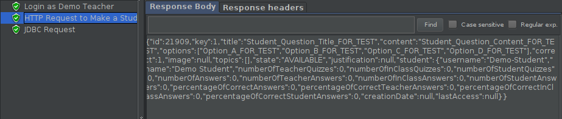
     
 - [x] [Cypress use case test](https://github.com/tecnico-softeng/es20al_06-project/blob/P4/frontend/tests/e2e/specs/studentQuestion/makeStudentQuestionAvailable.js)
   + Screenshot: 
   
     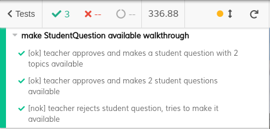

#### Feature number 5: _Um docente pode alterar uma pergunta aprovada antes de a colocar como fazendo parte do conjunto de perguntas disponíveis_

 - [x] [Service](https://github.com/tecnico-softeng/es20al_06-project/blob/P4/backend/src/main/java/pt/ulisboa/tecnico/socialsoftware/tutor/student_question/StudentQuestionService.java#L201)
 - [x] [Spock tests](https://github.com/tecnico-softeng/es20al_06-project/blob/P4/backend/src/test/groovy/pt/ulisboa/tecnico/socialsoftware/tutor/student_question/service/EditApprovedStudentQuestionServiceSpockTest.groovy)
 - [x] [JMeter feature tests](https://github.com/tecnico-softeng/es20al_06-project/blob/P4/backend/jmeter/studentQuestion/WSEditStudentQuestionAsTeacherTest.jmx)
   + Screenshots:
      
     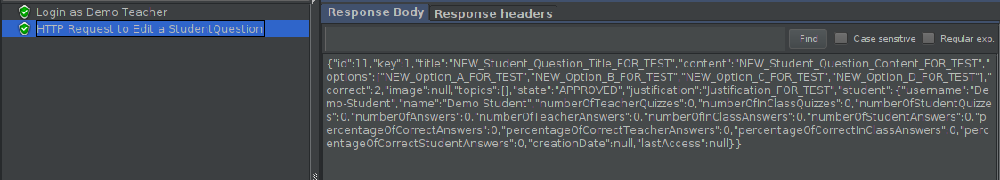
     
 - [x] [Cypress use case test](https://github.com/tecnico-softeng/es20al_06-project/blob/P4/frontend/tests/e2e/specs/studentQuestion/editStudentQuestionAsTeacher.js)
   + Screenshot: 
   
     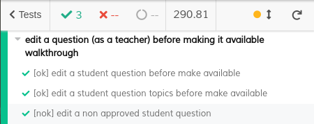
     
#### Feature number 6: _Uma pergunta rejeitada pode ser alterada e resubmetida pelo aluno_

  - [x] [Service](https://github.com/tecnico-softeng/es20al_06-project/blob/P4/backend/src/main/java/pt/ulisboa/tecnico/socialsoftware/tutor/student_question/StudentQuestionService.java#L189)
  - [x] [Spock tests](https://github.com/tecnico-softeng/es20al_06-project/blob/P4/backend/src/test/groovy/pt/ulisboa/tecnico/socialsoftware/tutor/student_question/service/EditRejectedStudentQuestionServiceSpockTest.groovy)
  - [x] [JMeter feature tests](https://github.com/tecnico-softeng/es20al_06-project/blob/P4/backend/jmeter/studentQuestion/WSEditStudentQuestionAsStudentTest.jmx)
    + Screenshots:
      
      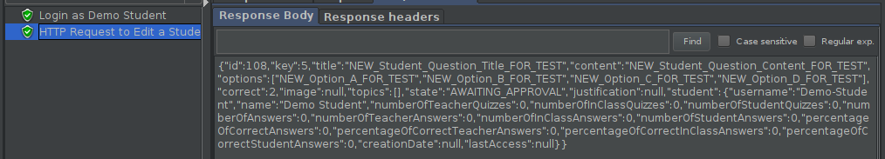
     
  - [x] [Cypress use case test](https://github.com/tecnico-softeng/es20al_06-project/blob/P4/frontend/tests/e2e/specs/studentQuestion/editStudentQuestion.js)
    + Screenshot: 
   
      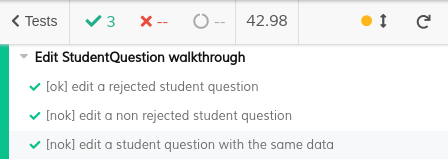

#### Feature number 7: _Existe um dashboard do aluno onde é apresentada informação acerca do seu número de perguntas propostas e aprovadas_

 - [x] [Service](https://github.com/tecnico-softeng/es20al_06-project/blob/P4/backend/src/main/java/pt/ulisboa/tecnico/socialsoftware/tutor/student_question/StudentQuestionService.java#L213)
 - [x] [Spock tests](https://github.com/tecnico-softeng/es20al_06-project/blob/P4/backend/src/test/groovy/pt/ulisboa/tecnico/socialsoftware/tutor/student_question/service/GetSQDashboardServiceSpockTest.groovy)
 - [x] [JMeter feature tests](https://github.com/tecnico-softeng/es20al_06-project/blob/P4/backend/jmeter/studentQuestion/WSGetSQDashboardTest.jmx)
   + Screenshots:
      
     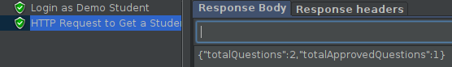
     
 - [x] [Cypress use case test](https://github.com/tecnico-softeng/es20al_06-project/blob/P4/frontend/tests/e2e/specs/studentQuestion/dashboardStudentQuestion.js)
   + Screenshot: 
   
     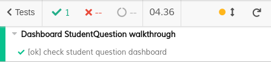

#### Feature number 8: _O aluno decide se esta informação no seu dashboard deve ser pública ou privada_

 - [x] [Service](https://github.com/tecnico-softeng/es20al_06-project/blob/P4/backend/src/main/java/pt/ulisboa/tecnico/socialsoftware/tutor/student_question/StudentQuestionService.java#L232)
 - [x] [Spock tests](https://github.com/tecnico-softeng/es20al_06-project/blob/P4/backend/src/test/groovy/pt/ulisboa/tecnico/socialsoftware/tutor/student_question/service/ChangeSQDashboardPrivacyServiceSpockTest.groovy)
 - [x] [JMeter feature tests](https://github.com/tecnico-softeng/es20al_06-project/blob/P4/backend/jmeter/studentQuestion/WSChangeSQDashboardPrivacyTest.jmx)
   + Screenshots:
      
     
     
 - [x] [Cypress use case test](https://github.com/tecnico-softeng/es20al_06-project/blob/P4/frontend/tests/e2e/specs/studentQuestion/changeSQDashboardPrivacy.js)
   + Screenshot: 
   
     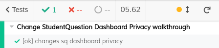

---

## Feature TDP

### Subgroup

 - Afonso Ribeiro, 89400, deadstrobe5
   + Issues assigned: [#118](https://github.com/tecnico-softeng/es20al_06-project/issues/118), [#129](https://github.com/tecnico-softeng/es20al_06-project/issues/129), [#131](https://github.com/tecnico-softeng/es20al_06-project/issues/131), [#137](https://github.com/tecnico-softeng/es20al_06-project/issues/137), [#143](https://github.com/tecnico-softeng/es20al_06-project/issues/143), [#144](https://github.com/tecnico-softeng/es20al_06-project/issues/144), [#157](https://github.com/tecnico-softeng/es20al_06-project/issues/157), [#155](https://github.com/tecnico-softeng/es20al_06-project/issues/155)
   + Tasks: F4:All tasks, F5:All Tasks, F8:FrontEnd
 - Guilherme Palma, 89452, guilherme439
   + Issues assigned: [#130](https://github.com/tecnico-softeng/es20al_06-project/issues/130), [#132](https://github.com/tecnico-softeng/es20al_06-project/issues/132), [#142](https://github.com/tecnico-softeng/es20al_06-project/issues/142), [#145](https://github.com/tecnico-softeng/es20al_06-project/issues/145), [#149](https://github.com/tecnico-softeng/es20al_06-project/issues/149), [#150](https://github.com/tecnico-softeng/es20al_06-project/issues/150), [#153](https://github.com/tecnico-softeng/es20al_06-project/issues/153), [#156](https://github.com/tecnico-softeng/es20al_06-project/issues/156)
   + Tasks: F6:All Tasks, F7:All Tasks, F8:Backend
 
### Pull requests associated with this feature

The list of pull requests associated with this feature is:

 - [PR #133](https://github.com/tecnico-softeng/es20al_06-project/pull/133)
 - [PR #152](https://github.com/tecnico-softeng/es20al_06-project/pull/152)
 - [PR #158](https://github.com/tecnico-softeng/es20al_06-project/pull/158)
 

### Listed features

Below, we list **only** the implemented features. For each feature, we link the relevant files and we mark which are requested parts are completed.

#### Feature number 4: _Se o número de alunos inscritos, incluindo o criador do torneio, for superior a 1, o sistema gera o quiz associado ao torneio_

 - [x] [Service](https://github.com/tecnico-softeng/es20al_06-project/blob/develop/backend/src/main/java/pt/ulisboa/tecnico/socialsoftware/tutor/tournament/TournamentService.java#L182)
 - [x] [Spock tests](https://github.com/tecnico-softeng/es20al_06-project/blob/develop/backend/src/test/groovy/pt/ulisboa/tecnico/socialsoftware/tutor/tournament/service/EnrollInTheTournamentServiceSpockTest.groovy#L136)
    
 - [ ] [JMeter feature tests](https://github.com)
     
 - [x] [Cypress use case test](https://github.com) (Use case is tested in Feature 8)

#### Feature number 5: _Os alunos participantes respondem às perguntas no período definido para o torneio_

 - [x] [Service](https://github.com/tecnico-softeng/es20al_06-project/blob/develop/backend/src/main/java/pt/ulisboa/tecnico/socialsoftware/tutor/tournament/TournamentService.java#L247)
 - [x] [Spock tests](https://github.com/tecnico-softeng/es20al_06-project/blob/develop/backend/src/test/groovy/pt/ulisboa/tecnico/socialsoftware/tutor/tournament/service/StartTournamentServiceSpockTest.groovy)

 - [x] [JMeter feature test](https://github.com/tecnico-softeng/es20al_06-project/blob/develop/backend/jmeter/tournament/WSStartTournamentTest.jmx)
     + Screenshots:
        
        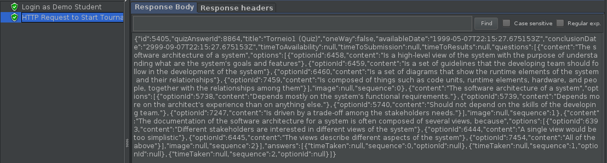

 - [x] [Cypress use case test](https://github.com/tecnico-softeng/es20al_06-project/blob/develop/frontend/tests/e2e/specs/student/answerTournamentQuiz.js)
     + Screenshots:
        
        

#### Feature number 6: _O aluno que criou o torneio pode cancelá-lo_

 - [x] [Service](https://github.com/tecnico-softeng/es20al_06-project/blob/develop/backend/src/main/java/pt/ulisboa/tecnico/socialsoftware/tutor/tournament/TournamentService.java#L140)
 - [x] [Spock tests](https://github.com/tecnico-softeng/es20al_06-project/blob/develop/backend/src/test/groovy/pt/ulisboa/tecnico/socialsoftware/tutor/tournament/service/CancelTournamentServiceSpockTest.groovy)
     
 - [x] [JMeter feature test](https://github.com/tecnico-softeng/es20al_06-project/blob/develop/backend/jmeter/tournament/WSCancelTournamentTest.jmx)
     + Screenshots:
        
        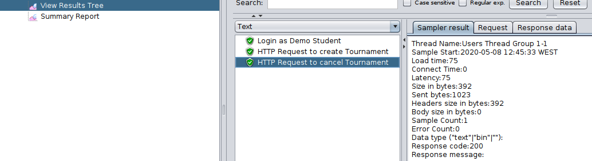

 - [x] [Cypress use case test](https://github.com/tecnico-softeng/es20al_06-project/blob/develop/frontend/tests/e2e/specs/student/cancelTournament.js)
     + Screenshots:
        
        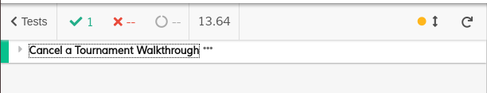

#### Feature number 7: _Existe um dashboard do aluno onde é apresentada informação acerca dos torneios em que participou e qual a sua pontuação_

 - [x] [Service](https://github.com/tecnico-softeng/es20al_06-project/blob/develop/backend/src/main/java/pt/ulisboa/tecnico/socialsoftware/tutor/tournament/TournamentService.java#L126)
 - [x] [Spock tests](https://github.com/tecnico-softeng/es20al_06-project/blob/develop/backend/src/test/groovy/pt/ulisboa/tecnico/socialsoftware/tutor/tournament/service/GetDashBoardTournamentsServiceTest.groovy)

 - [x] [JMeter feature test](https://github.com/tecnico-softeng/es20al_06-project/blob/develop/backend/jmeter/tournament/WSGetTournamentDashboard.jmx) 
     + Screenshots:
        
        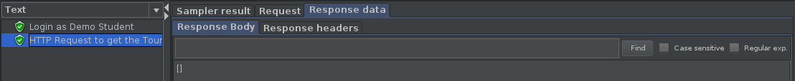

 - [x] [Cypress use case test](https://github.com/tecnico-softeng/es20al_06-project/blob/develop/frontend/tests/e2e/specs/student/tournamentDashboard.js)
     + Screenshots:
        
        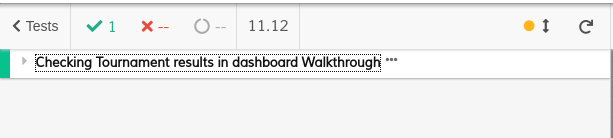

#### Feature number 8: _O aluno decide se esta informação no seu dashboard deve ser pública ou privada_

 - [x] [Service](https://github.com/tecnico-softeng/es20al_06-project/blob/develop/backend/src/main/java/pt/ulisboa/tecnico/socialsoftware/tutor/tournament/TournamentService.java#L291)

 - [ ] [Spock tests](https://github.com)

 - [x] [JMeter feature test](https://github.com/tecnico-softeng/es20al_06-project/tree/develop/backend/jmeter/tournament/WSChangePrivacyTest.jmx)
      + Screenshots:
            
         

 - [x] [Cypress use case test](https://github.com/tecnico-softeng/es20al_06-project/blob/develop/frontend/tests/e2e/specs/student/tournamentDashboard.js)
      + Screenshots:
            
          
         
         (This cypress test tests both features (4 and 8))

---
